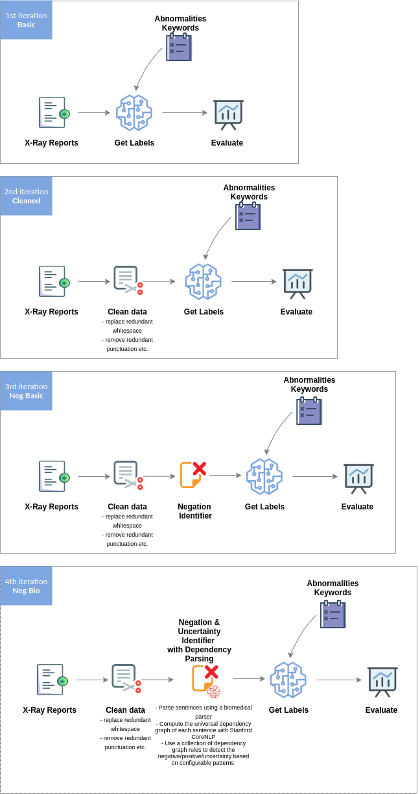
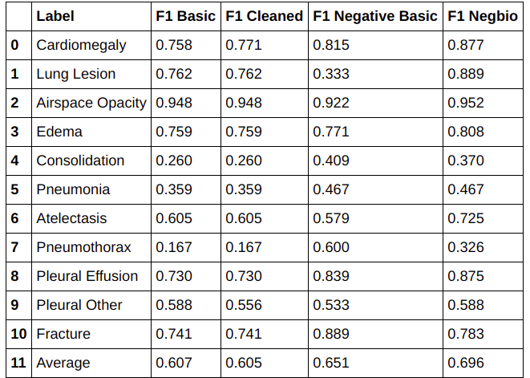

# medical-notes-ner

# Natural Language Entity Extraction

In this project we show how to extract ground truth labels from Radiology reports (unstructured medical text).  
  
Methods and techniques covered:
* Text matching
* Evaluating a labeler
* Negation detection
* Dependency parsing

# Solution Iterations
Applied Machine Learning is an iterative process. 
We start with a simple model/solution which we evaluate in every iteration and try to get better.

# Comparison
We compare using one or more evaluation metrics. For this particular data and problem we can use the F1 score, which we see is improving for most of the categories in every iteration:

